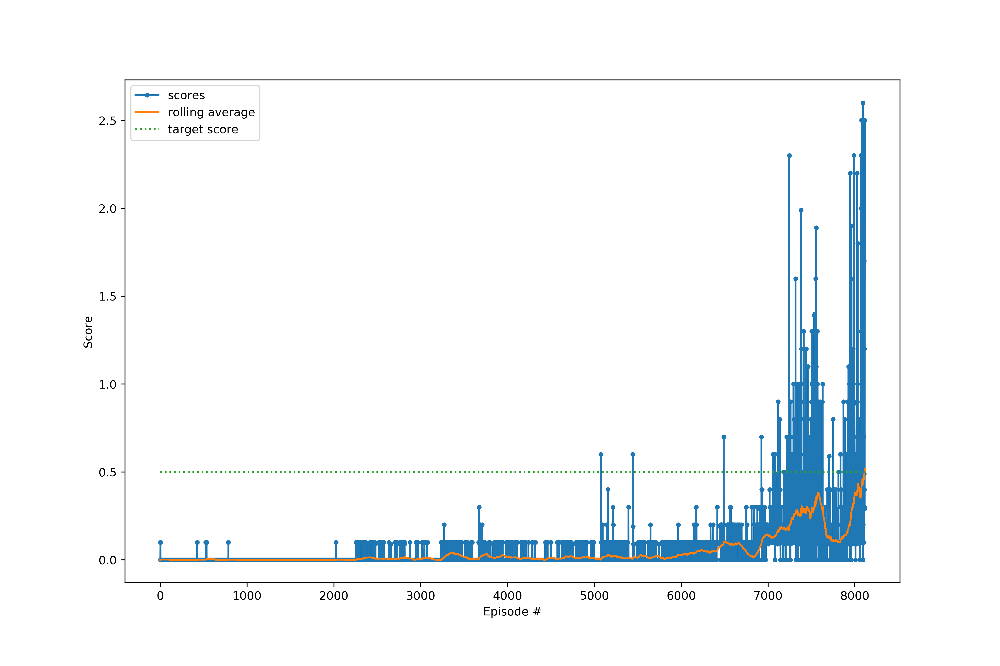

# Project 3: Tennis

This is the report for the third project in Udacity Deep Learning
specialisation. The report summarizes the solution of the Tennis project.

## Results

The environment was solved in 8015 episodes. It took quite a while for the
agents to actually figure out how to pass the ball to the other side, and even
longer for them to learn how to cooporate. Furthermore, the agents had a slight
regression around 6500 episodes where the average score had a bump down.
Fortunately it was possible to recover. 

## Learning Algorithm

The learning algorithm used is DDPG (Deep Deterministic Policy Gradient) [1]
with soft-update and an un-prioritized experience replay buffer. This fairly
simple algorithm is an improvement over DQN, when working with continuous
action spaces. In this case a single Actor and Critic operates on both ratchets
simultaneously. The algorithm used does not incorporate multi-agent
improvements to the DDPG algorithm. 

### Hyper-parameters

It took some effort to find a set of working hyper-parameters, however, it
actually turned out, that it worked without much tuning.

	Buffer_size = 5e5
	batch_size = 32
	gamma = 0.99
	tau = 5e-4
	actor_lr = 1e-4
	critic_lr = 4e-4

On top of that there are 2 parameters which control when a learning step is performed, 

	network_optimize_every_n_step = 4
	learn_iterations = 2

This set when learning is initiated (every 4 steps), and how many times
learning is done (2 times). This could of course have been set to 1 each, to
just run 1 learning iteration every step, but these parameters were changed
multiple times during optimizations.

#### Noise

Finally, after obtaining the action from the critic we add some noise. This
noise has is provided from white (gaussian) noise with a decaying scale. The
initial noise scale is 0.5 and decays with 0.999 after each episode. It has been
shown in other work, that gaussian noise works just fine when compared to
Ornstein-Uhlenbeck noise [2]

### Neural Netowrks

#### General architecture

The neural networks used are fully connected networks with N hidden layers
(build from a list of hidden layer sizes). Each hidden layer is connected to
the input layer neurons, e.g.:

	Input(state)  ---> Layer1 --> Layer 2  ----> Layer 3 ...  Layer N---> Output(action)
	    \   \___________________/               /             /
	     \_____________________________________/	         /

This means that layer 1 has e.g. 128 neurons, while layers 2 - 4 has 128 neurons +
the number of input parameters (43). 

The network used resembles residual networks, which have shortcut
connections of similar nature. These shortcuts are made to avoid diminishing
gradients, and aids in training a deeper neural network effeciently.

#### Actor

The actor has 3 hidden layers with 64, 32 and 32 neurons (both hidden layers
connected to input state). All layers (except the output) uses the leaky_relu activation
function. The output neurons are piped through a hypberbolic tangent activation
function.

#### Critic

The critic has 2 inputs, the state and the action. Both are concatenated as a
single input to the first layer. The network has 4 hidden layers all connected
to the inputs. The hidden layers have 128, 64, 64 and 32 neurons which use the
leaky relu activation function. There are no activation function on the output neuron.

## Future Work

This uses the most simple DDPG algorithm without any optimizations or extensions. 

It would be beneficial to implement prioritized experience replay, in order for
us to start learning faster (learning/cooporation only really kicks in after
5000 episodes. 

But most importantly, a real cooporative algorithm, like MADDPG [3] should be
attempted, such that the cricic actually takes all agents into consideration.

# References

[1] Lillicrap, T. P. et al. Continuous control with deep reinforcement learning. arXiv:1509.02971v6

[2] Fujimoto, S. et al. Addressing Function Approximation Error in Actor-Critic Methods. arXiv:1802.09477v3

[3] Lowe, R. et al. Multi-Agent Actor-Critic for Mixed Cooperative-Competitive Environments.  arXiv:1706.02275v4
